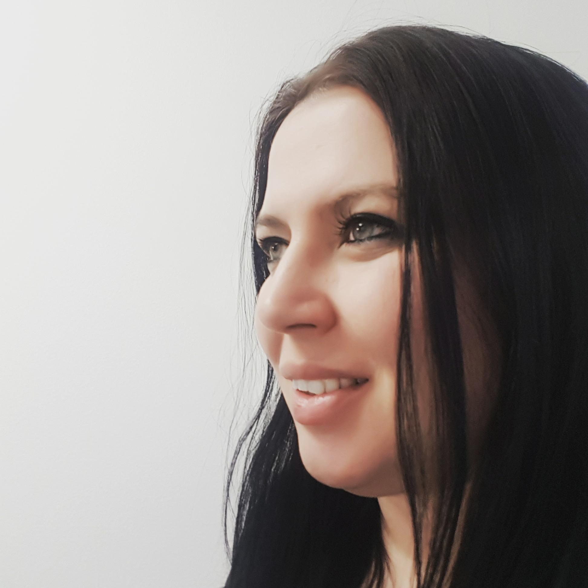

  
I am a teaching-focused Lecturer in the [School of Psychology](https://www.gla.ac.uk/schools/psychology/) at the University of Glasgow, where I joined in November 2018. I teach research methods, individual differences and #rstats. More generally, my expertise is in first year course design and leadership. I strongly believe in the principles of open science and I try to incorporate them whenever possible into my teaching and my research.

  

My research predominantly focuses on the relationship between technology and learning, in particular, lecture capture and how it can be used as an effective study tool and the impact on students from widening participation backgrounds. Since the disruption of COVID-19, my work has pivoted (pun intended) to supporting staff and students with a transition to online learning.

### Contact me

My e-mail address is emily.nordmann@glasgow.ac.uk. You can also find me on [Twitter](https://twitter.com/emilynordmann) where you can find me talking about teaching, lecture capture, open science, #rstats, swearing, LGBTQ issues and, occasionally, drag queens and videogames. 

If you need to see me in person I can be found in Room 412, [62 Hillhead Street](https://www.google.com/maps/place/62+Hillhead+St,+Glasgow+G12+8AD/@55.8737827,-4.2902561,17z/data=!3m1!4b1!4m5!3m4!1s0x488845cd968e9353:0xe0c5c8f039f9bc5d!8m2!3d55.8737797!4d-4.2880674).

