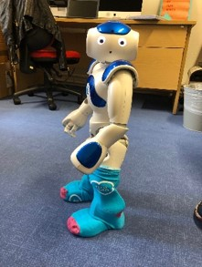

1. Name of all the University of Glasgow student halls of residence (i.e., not private providers). 1 point each

2. Which UofG twitterer has the most followers (correct as of 30/03/2020, don’t @ me): 
a) Niamh Stack 
b) Emily Nordmann 
c) Carolina Kuepper-Tetzel
d) Dale Barr

3. In 2018, the University of Glasgow made it to the quarter finals of University Challenge with two mascots in tow. What were they? 1 point per mascot.

4. Anagrams: Name that UofG building (1 point each): 
a) Bruised flaring  
b)Retrieving Sundays  
c)Balk heinously   

5. #TeamSobots clearly have great fashion sense – but what is the name of the robot?

